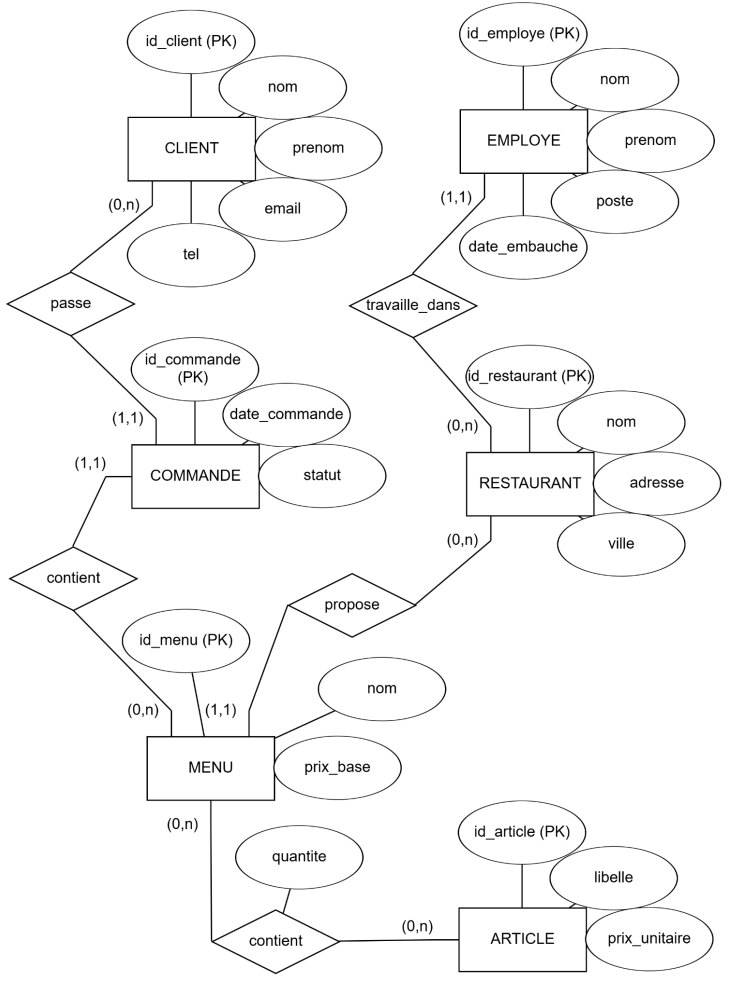
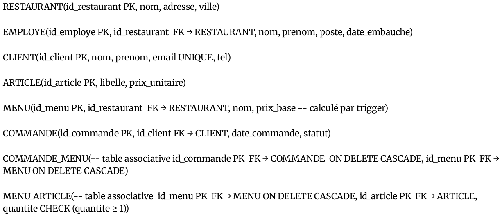

# Resto – SQLite → MongoDB

  

Projet académique de modélisation et d’implémentation d’une base de données pour la prise de commande en restauration.

* Modèle **EA** → **relationnel** (schémas dans `screenshots/`)
* **SQLite** : 8 tables, contraintes, **trigger** de calcul de prix, données d’exemple, 15 requêtes
* **MongoDB** : migration par exports JSON, **pipeline d’agrégation** & **Map‑Reduce**
* Résultat de l’évaluation : **5.5 / 6** (HEPIA, Genève)

> Ce repo montre une démarche from‑scratch : modélisation → SQL → NoSQL avec scripts reproductibles.

---

## Sommaire

1. [Aperçu rapide](#aperçu-rapide)
2. [Prérequis](#prérequis)
3. [Démarrage – SQLite](#démarrage--sqlite)
4. [Démarrage – MongoDB](#démarrage--mongodb)
5. [Structure du dépôt](#structure-du-dépôt)
6. [Points techniques clés](#points-techniques-clés)
7. [Captures](#captures)
8. [Licence & contact](#licence--contact)

---

## Aperçu rapide

* **Domaine** : restaurants, menus, articles, commandes, employés, clients
* **Règles** :

  * Composition *Menu–Article* via table associative `MENU_ARTICLE` avec attribut `quantite (≥ 1)`
  * Prix du menu **calculé automatiquement** (trigger après insert/update/delete sur `MENU_ARTICLE`)
  * Intégrité référentielle activée et cascades sur tables d’association
* **MongoDB** : collections isomorphes aux tables, pipeline `$lookup` + `$group` (CA par restaurant) et MapReduce (quantités par article)

---

## Prérequis

* **SQLite 3** (CLI) – disponible via Homebrew, APT, choco, etc.
* **MongoDB 6+** (serveur + `mongoimport` + shell `mongo` ou `mongosh`)
* Bash (pour exécuter les scripts dans `scripts/` sous macOS/Linux)

> Pour Windows : exécuter les commandes dans Git Bash/WSL ou adapter manuellement.

---

## Démarrage – SQLite

```bash
./scripts/run_sqlite.sh
```

Ce script :

1. crée `restaurant.db` à partir de `restaurant.sql` ;
2. vérifie la présence des tables et du trigger `maj_prix_menu` ;
3. contrôle le chargement des données d’exemple.

**Exemple de requête** :

```sql
-- articles plus chers que la moyenne
SELECT libelle, prix_unitaire
FROM ARTICLE
WHERE prix_unitaire > (SELECT AVG(prix_unitaire) FROM ARTICLE);
```

**CI GitHub** : un workflow (`.github/workflows/sqlite-test.yml`) reconstruit la DB et effectue des sanity‑checks lors du push.

---

## Démarrage – MongoDB

Importer toutes les collections JSON :

```bash
./scripts/import_mongo.sh
mongo
use resto
```

**Pipeline d’agrégation** (CA par restaurant) : `mongo/mongo_pipeline.js`

**Map‑Reduce** (quantités vendues par article) : `mongo/mapreduce_articles.js`

> Les fichiers JSON proviennent d’un export des tables SQLite.

---

## Structure du dépôt

```
.
├── restaurant.sql                # schéma + données + trigger
├── json_mongo/                   # exports JSON (8 collections)
├── mongo/
│   ├── mongo_pipeline.js         # $lookup + $group (CA par restaurant)
│   └── mapreduce_articles.js     # map/reduce -> totaux_articles
├── scripts/
│   ├── run_sqlite.sh             # build + sanity checks
│   └── import_mongo.sh           # mongoimport en boucle
├── screenshots/
│   ├── EA_restaurant.png         # diagramme EA
│   └── MR_restaurant.png         # schéma relationnel
└── .github/
    └── workflows/
        └── sqlite-test.yml       # petite CI
```

---

## Points techniques clés

* **Intégrité** : `PRAGMA foreign_keys = ON` ; FK sur tables d’association en `ON DELETE CASCADE`
* **Contraintes** : `CLIENT.email UNIQUE`, `MENU_ARTICLE.quantite CHECK (>=1)`
* **Trigger** : `maj_prix_menu` recalcule `MENU.prix_base` à chaque changement de composition
* **Limites assumées** : pas de gestion de stock, d’historique de prix, ni multi‑adresses ; identifiants numériques conservés en MongoDB pour la traçabilité

---

## Captures

<p align="center">
  
</p>

<p align="center">
  
</p>

---

## Licence & contact

* Licence : [MIT](LICENSE)
* Auteur : **Yassin EL HAKOUNI** – Genève (CH)
* Contact : [LinkedIn](https://www.linkedin.com/in/yassin-el-hakouni-10514a233/)

> Si ce projet vous intéresse : tous les retours sont appréciés.
